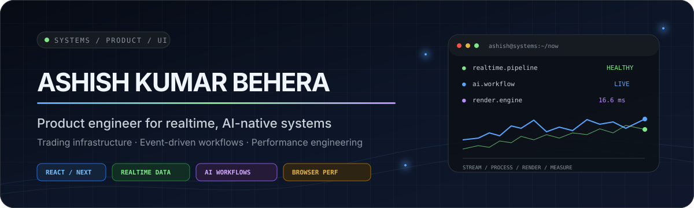

  

  <a href="#featured-labs"><strong>Labs</strong></a>
  &nbsp;·&nbsp;
  <a href="#client-work"><strong>Client work</strong></a>
  &nbsp;·&nbsp;
  <a href="#repository-map"><strong>Repository map</strong></a>
  &nbsp;·&nbsp;
  <a href="#archive-and-deprecation-registry"><strong>Archive registry</strong></a>

  

  
  
  

## Hello — I’m Ashish

I’m a product engineer focused on **realtime systems, trading infrastructure, AI-native workflows, browser performance, and high-density product interfaces**.

I build products where the interface is part of the system: streaming data, event-driven workflows, human-in-the-loop AI, rendering pipelines, and responsive frontend architecture.

<table>
  <tr>
    <td align="center"><strong>38</strong> owned repositories</td>
    <td align="center"><strong>8</strong> confirmed client deliveries</td>
    <td align="center"><strong>13</strong> labs and prototypes</td>
    <td align="center"><strong>3</strong> personal projects</td>
  </tr>
</table>

## Engineering stack

  

| Systems | Product engineering | Interface engineering |
| --- | --- | --- |
| WebSockets, SSE, streaming state, event-driven architecture | AI workflows, human review, auditability, product strategy | React, Next.js, TypeScript, design systems, data-dense UI |
| Market-data flows, realtime synchronization, low-latency thinking | Node.js, PostgreSQL, Redis, API integration | Web Workers, virtualization, OffscreenCanvas, render optimization |

## Featured labs

<table>
  <tr>
    <td width="50%" valign="top">
      <h3>DeviceCheckOnline</h3>
      
Browser-native diagnostics for displays, audio, microphones, keyboards, mice, cameras, networks, batteries, and accessibility.

      
<code>Astro</code> <code>TypeScript</code> <code>Web APIs</code>

      <a href="https://devicecheckonline.com"><strong>Open live product →</strong></a>
    </td>
    <td width="50%" valign="top">
      <h3>Blocord</h3>
      
A realtime market terminal and community concept combining market data, per-symbol discussion, AI-read sentiment, and compliance-aware research.

      
<code>Realtime</code> <code>Market data</code> <code>AI signals</code>

      <strong>Active private lab</strong>
    </td>
  </tr>
  <tr>
    <td width="50%" valign="top">
      <h3><a href="https://github.com/Ashishkkb/plugfast">plugfast</a></h3>
      
A measured React performance layer using virtualization, workers, <code>content-visibility</code>, OffscreenCanvas, and frame coalescing.

      
<code>React</code> <code>TypeScript</code> <code>Performance</code>

      <a href="https://github.com/Ashishkkb/plugfast"><strong>Explore repository →</strong></a>
    </td>
    <td width="50%" valign="top">
      <h3>Trading Terminal</h3>
      
A cross-platform trading workspace exploring dense realtime data, state architecture, charting, and mobile-first execution UX.

      
<code>Expo</code> <code>Realtime state</code> <code>Trading UX</code>

      <strong>Active private lab</strong>
    </td>
  </tr>
</table>

<strong>Open the complete lab and prototype collection</strong>

 

| Area | Repositories | State |
| --- | --- | --- |
| AI and workflow systems | <code>hitl-workflow-assistant</code>, <code>contentq-demo-v0.8xxx</code>, <code>legalync</code> | Prototype / review |
| Realtime and data-intensive UI | <a href="https://github.com/Ashishkkb/webskitters"><code>webskitters</code></a>, <code>trading_terminal</code>, <code>governanceefficiencysystem</code> | Active |
| Product experiments | <code>scis-app</code>, <code>sellFinder</code>, <code>uiassignment</code> | Active / portfolio |
| UI and performance engineering | <a href="https://github.com/Ashishkkb/uiki8"><code>uiki8</code></a>, <a href="https://github.com/Ashishkkb/plugfast"><code>plugfast</code></a> | Maintain / active |

## Client work

> Eight client deliveries confirmed from the supplied Vercel portfolio. Source repositories are private; live products are linked.

| Client project | What I delivered | Live product |
| --- | --- | --- |
| **SEN’S** · <code>sens-website</code> | Corporate sourcing and business website | [sensbusiness.com ↗](https://www.sensbusiness.com) |
| **DigitalTribes** · <code>newDigitalTribes</code> | Agency website with services, portfolio, testimonials, and lead generation | [digitaltribes.in ↗](https://digitaltribes.in) |
| **Pure Pickers** · <code>purepickers</code> | Export-focused food and agriculture catalogue | [purepickers.com ↗](https://www.purepickers.com) |
| **Profolio** · <code>profolio</code> | High-polish professional portfolio implementation | [akbprofolio.vercel.app ↗](https://akbprofolio.vercel.app) |
| **Dr. Jamsheera** · <code>medical_uae</code> | Accessible pediatric-dentistry website with appointment and SEO architecture | [specialchilddentist.com ↗](https://www.specialchilddentist.com) |
| **Eorbiter** · <code>eorbiter</code> | Cloud infrastructure and enterprise technology website | [eorbitor.vercel.app ↗](https://eorbitor.vercel.app) |
| **OpsIntelliX** · <code>opsintellix</code> | Intelligent-operations website with architecture and outcome-led storytelling | [opsintellix.vercel.app ↗](https://opsintellix.vercel.app) |
| **Resumate** · <code>resume_maker</code> | AI-assisted, ATS-safe resume tailoring workspace | [resume-maker-lyart.vercel.app ↗](https://resume-maker-lyart.vercel.app) |

## Personal work

| Repository | Role |
| --- | --- |
| <code>portfolio2</code> | Current canonical personal portfolio |
| [<code>getricheasy</code>](https://github.com/Ashishkkb/getricheasy) | Personal commercial and career strategy notes |
| <code>studio</code> | SlideAce, a gamified sliding-puzzle experiment |

## Repository map

<strong>Client, professional, lab, personal, fork, and legacy classification</strong>

 

| Category | Repositories |
| --- | --- |
| 🟣 Confirmed client work | <code>sens-website</code>, <code>newDigitalTribes</code>, <code>purepickers</code>, <code>profolio</code>, <code>medical_uae</code>, <code>eorbiter</code>, <code>opsintellix</code>, <code>resume_maker</code> |
| 🔵 Professional builds pending confirmation | <code>avnl</code>, <code>rayntra</code> |
| 🟢 Active labs and prototypes | <code>devicecheckonline</code>, <code>blocord</code>, <code>plugfast</code>, <code>scis-app</code>, <code>trading_terminal</code>, <code>governanceefficiencysystem</code>, <code>sellFinder</code>, <code>hitl-workflow-assistant</code>, <code>contentq-demo-v0.8xxx</code>, <code>webskitters</code>, <code>uiki8</code>, <code>legalync</code>, <code>uiassignment</code> |
| 🟡 Personal work | <code>getricheasy</code>, <code>portfolio2</code>, <code>studio</code> |
| ⚪ Upstream forks / source study | <code>cal.com</code>, <code>langflow</code> |
| 🔴 Superseded or archival | <code>contentq-demo-deploy</code>, <code>akbfolio</code>, <code>portfolio</code>, <code>latestportfolio</code>, <code>prouiki8</code>, <code>orderbooking</code>, <code>aniccavision</code>, <code>r3f-christmas-card-experience-main</code>, <code>lochlandingpage</code> |
| ⚙️ Profile infrastructure | <code>Ashishkkb</code> |

## Archive and deprecation registry

> This is a maintenance plan—not a record of completed deletion. Archive first whenever ownership, deployment, or unique branch history is uncertain.

### Deprecated · remove after verification

| Repository | Reason | Exit check |
| --- | --- | --- |
| <code>contentq-demo-deploy</code> | Empty repository | Safe first deletion candidate |
| <code>akbfolio</code> | Superseded portfolio variant | Confirm <code>portfolio2</code> contains any unique assets |
| <code>portfolio</code> | Superseded portfolio variant | Migrate unique copy or components |
| <code>latestportfolio</code> | Older than the canonical <code>portfolio2</code> | Confirm no Vercel project still deploys it |
| <code>prouiki8</code> | Private precursor/duplicate of <code>uiki8</code> | Compare unique commits and components |
| <code>r3f-christmas-card-experience-main</code> | Old template-derived learning experiment | Keep only if it still has portfolio value |

### Archive first · review before deletion

<strong>Show repositories recommended for read-only archival</strong>

 

| Repository | Why archive it | Delete only when… |
| --- | --- | --- |
| <code>orderbooking</code> | 2024 Next.js project with generated README and default metadata | No client or historical value remains |
| <code>aniccavision</code> | 2024 monitoring dashboard with generated metadata and a temporary tunnel endpoint | Employer/client ownership is confirmed |
| <code>lochlandingpage</code> | 2023 landing page with generated README and sample API route | No live deployment depends on it |
| <code>cal.com</code> | Stale upstream fork | It has no unique branch, PR, or patch |
| <code>langflow</code> | Stale upstream fork | It has no unique branch, PR, or patch |
| <code>legalync</code> | Older product prototype with generated Lovable README and placeholder areas | It is no longer a useful portfolio case study |
| <code>hitl-workflow-assistant</code> | Older AI workflow prototype | Its interaction patterns are documented elsewhere |
| <code>uiki8</code> | Older UI-library experiment | <code>plugfast</code> or another library fully replaces its value |
| <code>studio</code> | Older standalone game experiment | It is not needed as an interaction-design sample |

For the full evidence and repository-by-repository reasoning, open [<strong>REPOSITORY_AUDIT.md</strong>](REPOSITORY_AUDIT.md).

## GitHub signal

  
  

  

## Let’s build something demanding

I’m open to work involving **realtime systems, trading infrastructure, AI-native products, frontend architecture, and performance-focused product engineering**.

  
  
  

Designed as a living map of shipped work, active labs, and intentional archives.

