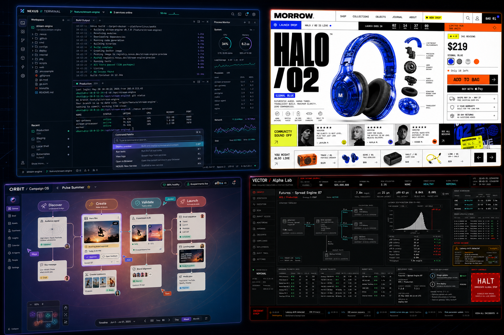

  

  <a href="#featured-labs"><strong>Labs</strong></a>
  &nbsp;·&nbsp;
  <a href="#systems-gallery"><strong>Systems gallery</strong></a>
  &nbsp;·&nbsp;
  <a href="#client-work"><strong>Client work</strong></a>
  &nbsp;·&nbsp;
  <a href="#project-universe"><strong>Project universe</strong></a>
  &nbsp;·&nbsp;
  <a href="#lets-build-something-demanding"><strong>Contact</strong></a>

  

  
  
  

## Hello — I’m Ashish

I’m a product engineer focused on **realtime systems, trading infrastructure, AI-native workflows, browser performance, and high-density product interfaces**.

I build products where the interface is part of the system: streaming data, event-driven workflows, human-in-the-loop AI, rendering pipelines, and responsive frontend architecture.

<table>
  <tr>
    <td align="center"><strong>22</strong> owned repositories</td>
    <td align="center"><strong>8</strong> confirmed client deliveries</td>
    <td align="center"><strong>9</strong> product labs</td>
    <td align="center"><strong>4</strong> public showcases</td>
  </tr>
</table>

## Engineering stack

  

| Systems | Product engineering | Interface engineering |
| --- | --- | --- |
| WebSockets, SSE, streaming state, event-driven architecture | AI workflows, human review, auditability, product strategy | React, Next.js, TypeScript, design systems, data-dense UI |
| Market-data flows, realtime synchronization, low-latency thinking | Node.js, PostgreSQL, Redis, API integration | Web Workers, virtualization, OffscreenCanvas, render optimization |

## Systems gallery

  

  <strong>NEXUS // Terminal</strong> · <strong>MORROW Commerce</strong> · <strong>ORBIT Campaign OS</strong> · <strong>VECTOR Alpha Lab</strong>

> Four interface studies, one engineering philosophy: make complex systems feel legible, responsive, and deliberate.

## Featured labs

<table>
  <tr>
    <td width="50%" valign="top">
      <h3>DeviceCheckOnline</h3>
      
Browser-native diagnostics for displays, audio, microphones, keyboards, mice, cameras, networks, batteries, and accessibility.

      
<code>Astro</code> <code>TypeScript</code> <code>Web APIs</code>

      <a href="https://devicecheckonline.com"><strong>Open live product →</strong></a>
    </td>
    <td width="50%" valign="top">
      <h3>Blocord</h3>
      
A realtime market terminal and community concept combining market data, per-symbol discussion, AI-read sentiment, and compliance-aware research.

      
<code>Realtime</code> <code>Market data</code> <code>AI signals</code>

      <strong>Active private lab</strong>
    </td>
  </tr>
  <tr>
    <td width="50%" valign="top">
      <h3><a href="https://github.com/Ashishkkb/plugfast">plugfast</a></h3>
      
A measured React performance layer using virtualization, workers, <code>content-visibility</code>, OffscreenCanvas, and frame coalescing.

      
<code>React</code> <code>TypeScript</code> <code>Performance</code>

      <a href="https://github.com/Ashishkkb/plugfast"><strong>Explore repository →</strong></a>
    </td>
    <td width="50%" valign="top">
      <h3>Trading Terminal</h3>
      
A cross-platform trading workspace exploring dense realtime data, state architecture, charting, and mobile-first execution UX.

      
<code>Expo</code> <code>Realtime state</code> <code>Trading UX</code>

      <strong>Active private lab</strong>
    </td>
  </tr>
</table>

<strong>Explore the complete product-lab constellation</strong>

 

| Engineering lane | Projects | What connects them |
| --- | --- | --- |
| Realtime intelligence | <code>blocord</code>, <code>trading_terminal</code>, <code>governanceefficiencysystem</code> | Dense data, streaming state, explainable decisions |
| AI-native operations | <code>scis-app</code>, <code>contentq-demo-v0.8xxx</code>, <code>sellFinder</code> | AI-assisted workflows with useful product boundaries |
| Browser and UI engineering | <code>devicecheckonline</code>, <a href="https://github.com/Ashishkkb/plugfast"><code>plugfast</code></a>, <a href="https://github.com/Ashishkkb/uiki8"><code>uiki8</code></a> | Native browser capability, performance, reusable interaction systems |

## Client work

> Selected client deliveries. Source repositories are private; live products are linked.

| Client project | What I delivered | Live product |
| --- | --- | --- |
| **SEN’S** · <code>sens-website</code> | Corporate sourcing and business website | [sensbusiness.com ↗](https://www.sensbusiness.com) |
| **DigitalTribes** · <code>newDigitalTribes</code> | Agency website with services, portfolio, testimonials, and lead generation | [digitaltribes.in ↗](https://digitaltribes.in) |
| **Pure Pickers** · <code>purepickers</code> | Export-focused food and agriculture catalogue | [purepickers.com ↗](https://www.purepickers.com) |
| **Profolio** · <code>profolio</code> | High-polish professional portfolio implementation | [akbprofolio.vercel.app ↗](https://akbprofolio.vercel.app) |
| **Dr. Jamsheera** · <code>medical_uae</code> | Accessible pediatric-dentistry website with appointment and SEO architecture | [specialchilddentist.com ↗](https://www.specialchilddentist.com) |
| **Eorbiter** · <code>eorbiter</code> | Cloud infrastructure and enterprise technology website | [eorbitor.vercel.app ↗](https://eorbitor.vercel.app) |
| **OpsIntelliX** · <code>opsintellix</code> | Intelligent-operations website with architecture and outcome-led storytelling | [opsintellix.vercel.app ↗](https://opsintellix.vercel.app) |
| **Resumate** · <code>resume_maker</code> | AI-assisted, ATS-safe resume tailoring workspace | [resume-maker-lyart.vercel.app ↗](https://resume-maker-lyart.vercel.app) |

## Personal work

| Repository | Role |
| --- | --- |
| <code>portfolio2</code> | Current canonical personal portfolio |
| [<code>getricheasy</code>](https://github.com/Ashishkkb/getricheasy) | Personal commercial and career strategy notes |

## Professional builds

<table>
  <tr>
    <td width="50%" valign="top">
      <h3><a href="https://github.com/Ashishkkb/avnl">AVNL</a></h3>
      
A modern information architecture and web experience for Armoured Vehicles Nigam Limited, a Government of India enterprise.

      
<code>Next.js</code> <code>Content architecture</code> <code>Public sector</code>

    </td>
    <td width="50%" valign="top">
      <h3>Rayntra</h3>
      
A product-rich corporate website spanning solar modules, energy storage, inverters, sectors, and applications.

      
<code>Next.js</code> <code>Energy</code> <code>Product storytelling</code>

    </td>
  </tr>
</table>

## Project universe

<strong>Open the complete map of current owned repositories</strong>

 

| Track | Repositories |
| --- | --- |
| Client delivery | <code>sens-website</code>, <code>newDigitalTribes</code>, <code>purepickers</code>, <code>profolio</code>, <code>medical_uae</code>, <code>eorbiter</code>, <code>opsintellix</code>, <code>resume_maker</code> |
| Professional web builds | <a href="https://github.com/Ashishkkb/avnl"><code>avnl</code></a>, <code>rayntra</code> |
| Product labs | <code>devicecheckonline</code>, <code>blocord</code>, <code>trading_terminal</code>, <code>governanceefficiencysystem</code>, <code>scis-app</code>, <code>contentq-demo-v0.8xxx</code>, <code>sellFinder</code>, <a href="https://github.com/Ashishkkb/plugfast"><code>plugfast</code></a>, <a href="https://github.com/Ashishkkb/uiki8"><code>uiki8</code></a> |
| Personal work | <code>portfolio2</code>, <a href="https://github.com/Ashishkkb/getricheasy"><code>getricheasy</code></a> |
| Profile | <a href="https://github.com/Ashishkkb/Ashishkkb"><code>Ashishkkb</code></a> |

## How I build

<table>
  <tr>
    <td width="33%" valign="top"><strong>01 · Model the system</strong> States, events, ownership, failure modes, and data flow before decoration.</td>
    <td width="33%" valign="top"><strong>02 · Design the interaction</strong> Dense information can still feel calm when hierarchy and feedback are deliberate.</td>
    <td width="33%" valign="top"><strong>03 · Measure reality</strong> Performance claims need traces, benchmarks, budgets, and honest trade-offs.</td>
  </tr>
</table>

## Open-source shelf

<table>
  <tr>
    <td width="50%" valign="top">
      <h3><a href="https://github.com/Ashishkkb/plugfast">plugfast</a></h3>
      
Measured browser-performance primitives for demanding React interfaces.

      
      
    </td>
    <td width="50%" valign="top">
      <h3><a href="https://github.com/Ashishkkb/uiki8">uiki8</a></h3>
      
A 3D-enabled component and interaction library for modern web products.

      
      
    </td>
  </tr>
  <tr>
    <td width="50%" valign="top">
      <h3><a href="https://github.com/Ashishkkb/avnl">AVNL</a></h3>
      
Large-scale public-sector information architecture and frontend implementation.

      
      
    </td>
    <td width="50%" valign="top">
      <h3><a href="https://github.com/Ashishkkb/getricheasy">getricheasy</a></h3>
      
A public working notebook for commercial strategy and engineering career leverage.

      
      
    </td>
  </tr>
</table>

## GitHub signal

  
  

  

## Let’s build something demanding

I’m open to work involving **realtime systems, trading infrastructure, AI-native products, frontend architecture, and performance-focused product engineering**.

  
  
  

Designed as a living map of shipped systems, active products, and ambitious experiments.

